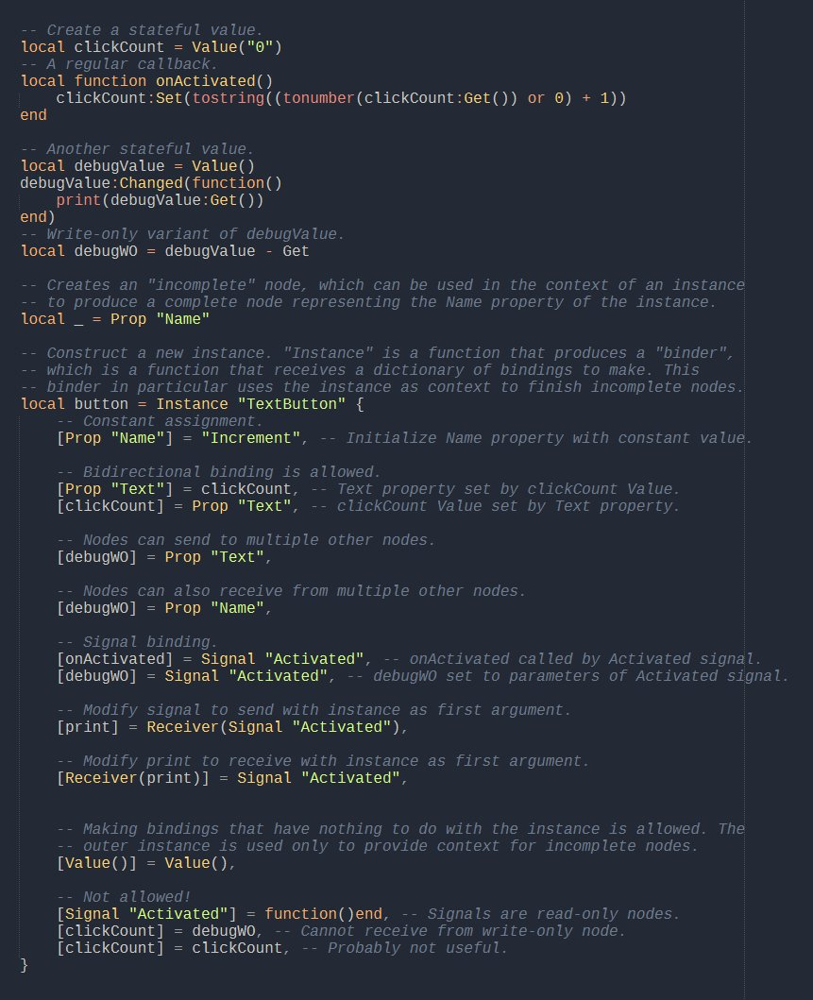
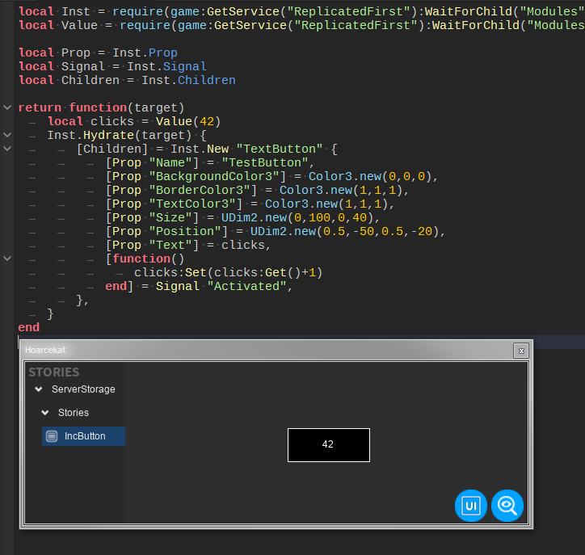
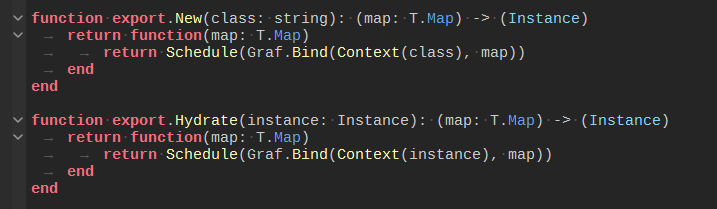
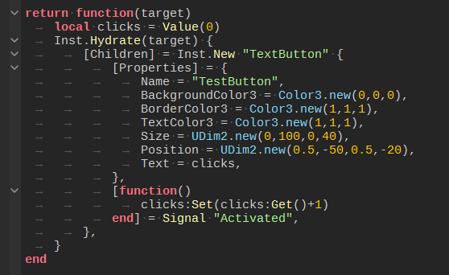

+++
title = "Reactive graphs"
date = 2021-12-29 14:51:06
tags = ["roblox", "programming", "codeimage"]
+++

Thinking about APIs.

One idea was using add/sub to compose sets of symbol types, such as `Prop
"Name"-Set` for a read-only property node, or `Receiver+Signal "Activated"` for
a signal with a receiver. The Get/Set symbols would then be usable with Nodes to
control direction. I'm not sure how I feel about it, because it would enable
weird things like `Prop "Foo" + Attr "Bar"`.

----

Prototyping. Nothing actually graphy yet. "Prop" does get repetitive, so it
definitely needs a "Properties" tag that receives a dictionary.

Inst isn't built in the to core ("Graf"). Instead, the core defines interfaces,
and Inst is just an implementation that operates on instances. Bind does the
heavy lifting of making data flow.

Bind returns the instance, along with a list of tasks to be finalized somewhere.
Schedule just sets these tasks to be finalized when the instance is destroyed.
Context returns a resolver that converts things like `Prop"Name"` into actual
state.

Implementing recursion. A context can resolve a sink (stuff on the left) into
another context, which must receive a map as a source (stuff on the right). In
this example, Properties becomes a context that converts string sinks into
property setters in addition to the usual stuff.

