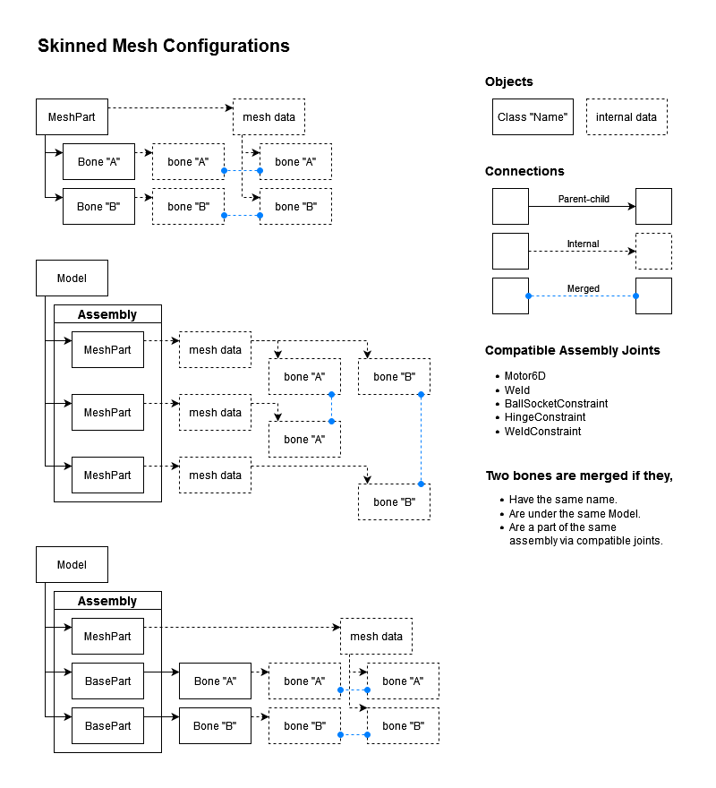

+++
title = "Cloth physics"
date = 2022-01-12 20:39:04
tags = ["roblox", "gamedev"]
+++

Here's cloth physics via RodConstraints. Cloth is a MeshPart deformed by bones.
Bone positions are matched to node positions by a script. An AngularVelocity
dampens each node, since their rotations like to go crazy for some reason.

Bones have to be parented to a MeshPart to work, so a script is necessary. It
would be neat if they could refer to a mesh instead, so that they could be
placed inside different parts.

Seems to run surprisingly well. Like capes-for-everyone might be viable, at
least for a low player count.

The MeshPart is anchored, but its appearance is deformed using bones. A script
updates the positions of the bones every frame to match the positions of the red
balls, which are simulated with Roblox’s physics.

Here's cloth with SpringConstraints instead of rods. LinearVelocity dampens
movement. VectorForce negates gravity to reduce weight. Spring Stiffness makes
the cloth more or less stretchy.

RodConstraints are much better for less stretchy material, but the
LinearVelocity force has to be increased to compensate for the increased
rigidity:

Apparently the orientation of bones affects the vertex normals of meshes, so I
can't really get away with just ignoring it. No good way using constraints, so
I'll have to calculate it in Luau.

----

What am I doing with my life.

So, yes, it is possible to control bones with other parts, but it requires
certain constraint types to work. BallAndSocket is the most versatile, so I'll
see if I can construct cloth out of that. Until then, it's floppy rigatoni.

> "hey tony, rig me a pasta noodle"
>
> I'll have to rig-a-toni. Hahaha HAHAHAHAA AAAAAAAAAAAAAAAAAAAAAAAAA
>
> --- Me (utterly deranged)

----

Think I have a general theory of how skinned meshes work. Two bones are merged
if and only if they:

- have the same Name.
- are under the same Model.
- are a part of the same assembly via compatible joints (JointInstance,
  BallSocketConstraint, HingeConstraint).

If more than two bones meet these criteria, only one pair is merged. It's not
clear which pair is selected, but it's probably undefined.

Bones usually exist internally in a mesh. The Bone instance can be thought of as
creating a virtual internal bone that is then merged as usual.

Some examples of valid skinned mesh configurations (I forgot to update the
compatible joint list; any JointInstance is allowed, not just Motor6Ds and
Welds):

> We variously called them “skinning islands” or “skeletons” instead of
> assemblies (can span multiple assemblies or just a subset of one), but that’s
> pretty much it. Bones don’t have to be child of mesh at all.
>
> This is how skinned avatars work. Parts link up, internal bones linked to the
> respective parts. Using Parts instead of Bones but it’s all using the same
> logic.
>
> --- [@ContextLostRBX, 8:26 AM · Jan 17, 2022](https://twitter.com/ContextLostRBX/status/1482992805953736704)

----

Here's cloth driven entirely by physics. No scripts. Vertex normals are still a
problem because the BallSockets are allowed to twist. But if twist limits are
enabled, they start vibrating for some reason. Maybe the attachments are
oriented wrong.

Constructed in a zigzag because I had trouble getting the mesh to merge to the
assembly any other way. Either it only merges into one branch of an assembly, or
it's something to do with the attachments. Doesn't seem to care about the
direction of the connections, though.

BallSockets have a sort of stiffness property that can be used to dampen the
motion, but this only works well for stiffer cloths. LinearVelocity will be
better for lighter cloth because it simulates air resistance.

The horizontal red lines are Rods. It would actually be better to make these
parts with BallSockets on each end, so that all joints can have stiffness
applied to them. I'm not sure how that would affect the "branchiness" of the
assembly, though.

Tried a new skeleton consisting of rows of chains of bones, which correspond to
chains of BallSockets. Each joint is then connected by a Rod. The problem now is
that character movement is way too aggressive. Maybe increasing the cloth weight
will help?

What happens when I enable collisions:

Nuking appears to be caused by cloth joints getting under the Humanoid. So,
instead of colliding with the Default group, a separate "ClothExclusion" group
is used (in red). Lowering the UpperAngle of the BallSockets reduces flailing
and tangling. Limb clipping still a problem.

The problem with limbs is that the Humanoid forces them to have no collisions.
Could be resolved by attaching ClothExclusion parts to each limb. Not sure how
badly that will affect flailing, though, if they even collide correctly.

Something to try is to attach an AlignPosition with a weak force to the end of
each chain, aligning to the expected resting position of the end relative to the
character. It may also be possible to alter them dynamically to improve air
resistance simulation.

Another problem is that something is interfering with jumping, leading to the
character being pushed horizontally. Also, landing wrong can cause the cloth to
detonate.

The jumping problem is caused by the cloth joints affecting the inertia of the
character. Simply moving the cloth outside of the character model solved the
problem.

Tried this, but it works rather poorly. The cloth doesn't respond to limb
movement very well, so it still clips right through. A combination of reducing
limb animation and increasing the number of chains might help.
