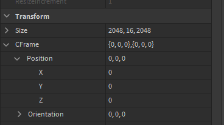

+++
title = "CFrames"
date = 2022-02-01 18:54:55
tags = ["roblox", "rant"]
+++

Attributes are not allowed to be CFrames. Why.

Moreover, since Roblox's inception they haven't displayed CFrames in the
properties panel. Instead we've been getting things like Position/Orientation
pseudo-representations for select properties.

Roblox could have done this years ago:

