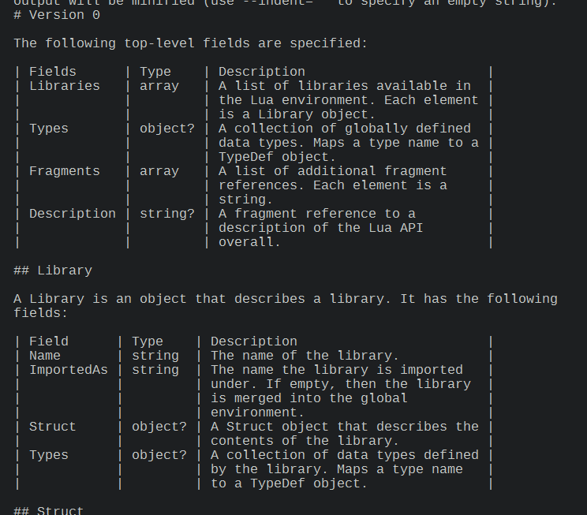

+++
title = "Table column widths"
date = 2022-03-25 14:27:52
tags = ["programming"]
+++

Given an array of integers representing the widths of table columns, here is a
formula that decides in-place whether a column is considered significantly
larger than the others. I use this to decide whether a column should be scaled
down to allow the table to fit a maximum width.

```go
T := Sum(array)
L := Length(array)
i := array[index]

big := i/T > (1 - i/T) / (L-1)
```

It basically compares the proportion of the current column with the average
proportion of the rest of the table.

Better formula:

```go
i/T     > (1 - i/T)       / (L-1)
i/T * T > (1 - i/T) * T   / (L-1)
i/T     > (1*T - i/T * T) / (L-1)
i       > (T - i)         / (L-1)
```

Now I have a decent-looking but crudely-implemented way to render tables in the
terminal.


