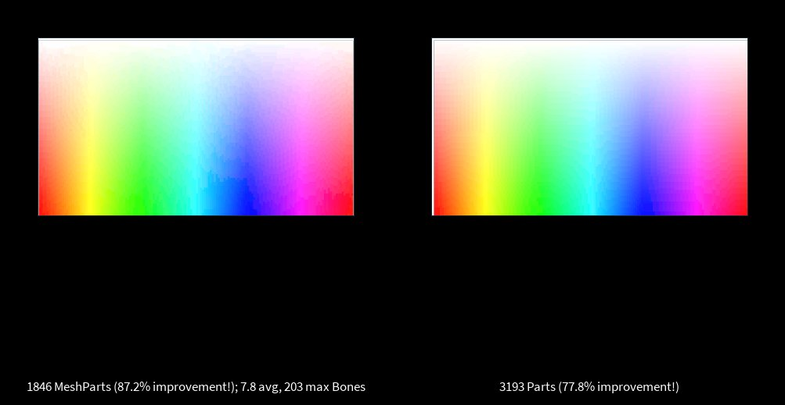

+++
title = "Greedy skinned meshes"
date = 2022-04-05 13:12:57
tags = ["roblox", "gamedev"]
+++

Using skinned meshes instead of parts to reduce the part count for Boatbomber's
[ViewportCanvas][vc]. Unfortunately, the initial rendering takes way too long to
be feasible.

[vc]: https://github.com/boatbomber/ViewportCanvas
