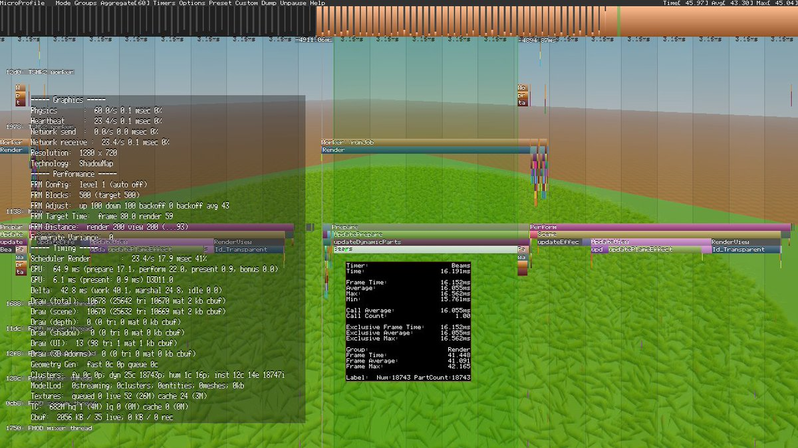

+++
title = "Grass"
date = 2022-07-11 12:21:19
tags = ["roblox", "gamedev"]
+++

Physically simulated grass.

Single triangle rigged with two bones. Lower bone is attached to a colliding
part via BallSocket. Upper bone has a VectorForce to keep the whole thing
upright, and an AngularVelocity to introduce some instability that simulates
wind.

Some translucency can be simulated by rotating the upper bone by 180 degrees,
which also rotates the normal of the top vertex.

One MeshPart can be rigged to fit up to 128 grass units, whereas Beams would
have to be 1:1. But in terms of visuals, Beams have much more to offer than
Decals.

A texture can be used, but artifacts occur on the upper edge because the texture
wraps around and repeats.

> you can get around this using the TextureLength property
>
> --- [@ChrythmDev, 10:23 PM · Jul 14, 2022](https://twitter.com/ChrythmDev/status/1547708323180343296)

I guess that works, but the texture has to be upside down.

On whether using beams is practical: disregarding physics, most of the time goes
into updating beam logic. Actual rendering is sub-optimal, but it isn't the
bottleneck. Not sure what causes LOD cutoff (it's not affected by graphics
settings). Might be a memory thing.

