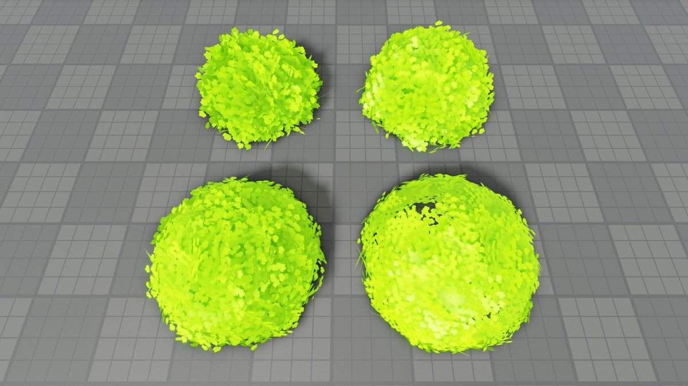

+++
title = "Foliage"
date = 2022-09-29 22:51:14
tags = ["roblox", "gamedev"]
+++

Playing with foliage. Here we have the same texture, triangle count, and
triangle size, but different scaling of the base shape, which is a sphere in
this case. Unfortunately, it's hard to get something that looks good without
fine-tuning each of these parameters.

