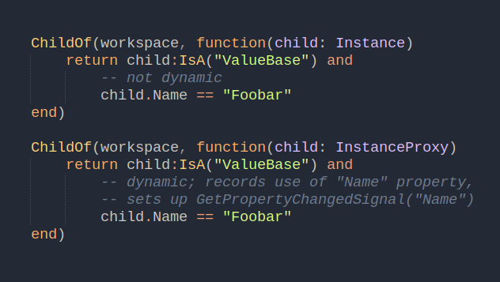
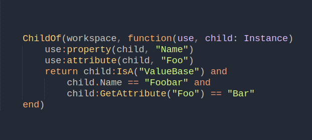

+++
title = "Fusion predicates"
date = 2022-10-17 13:02:08
tags = ["roblox", "fusion"]
+++

I was thinking of a Fusion-like way to select children based on a predicate
function.

More tasteful syntax:

