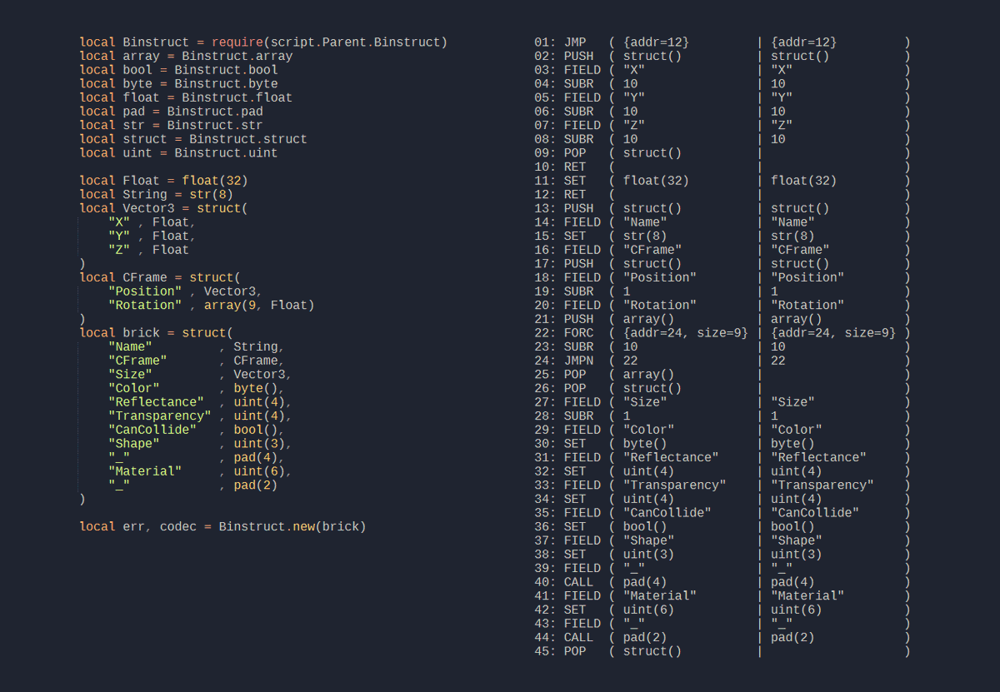

+++
title = "Binstruct rewrite"
date = 2022-10-30 12:23:45
tags = ["roblox", "library"]
+++

Rewriting Binstruct to be more ergonomic. Also added support for recursive type
definitions, which is implemented in the VM as subroutines. Continues to be my
favorite module to write.

Rewrote Binstruct's union type to work like an if statement. Here's what parsing
a value for serialized attributes looks like.

Because type definitions in Binstruct are just tables, it's really easy to
create abstractions to make defining types more ergonomic. This is an example of
a builder that allows advanced functions to be added to a definition more
easily.

The builder in action. The decode/encode functions convert between a finalized
value and an intermediate representation that is more easily digested by the
codec, though this representation is often useful enough on its own.

All good data formats have a version number. Here's a constructor that applies
versioning to any type. It uses a union to match a version to one of a number of
types. The version is also available as a "global", allowing the value to be
inspected from anywhere in the structure.

