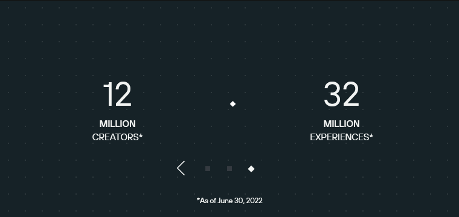

+++
title = "Go big"
date = 2023-02-02 15:19:31
tags = ["roblox", "observation"]
+++

Investors: How make number go bigger?

Roblox:

https://devforum.roblox.com/t/beta-update-new-experiences-have-team-create-enabled/2172232

For comparison, stats as displayed on 2022-11-15:

Idiot theory: Roblox made a bad-faith measurement of developers/experiences in
Q2, with the stats from Q3 (above) being more accurate. To address number go
down, they're pushing Team Create hard to make number go big again.
