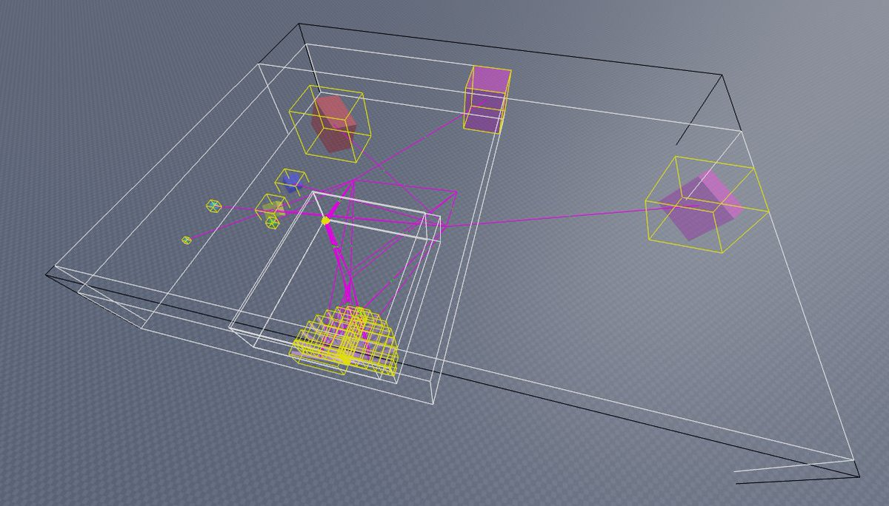
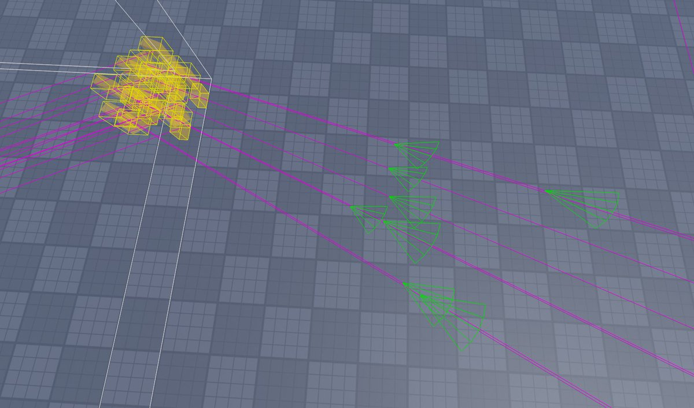

+++
title = "R-tree"
date = 2023-03-17 11:11:04
tags = ["roblox", "gamedev"]
+++

Visualization of an r-tree. WireframeHandleAdornment is essential for debugging.

It's harder to draw shapes, but it's way better than keeping track of a million
handle adornments.

