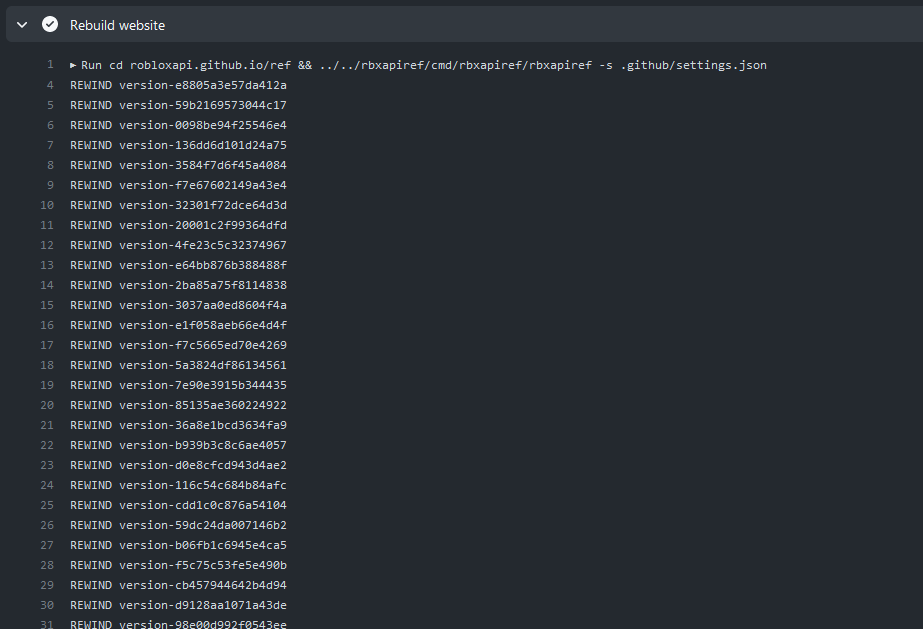

+++
title = "Rewinding"
date = 2023-11-10 15:34:24
tags = ["rbxapiref"]
+++

This is fine. I'm okay with the events that are unfolding currently.

"Fixed" it. There's some rewind logic that stops new builds from being displayed
until Roblox says they're live. It seems to malfunction when a build hash
appears more than once in the deploy history. Fixed by disabling rewind, so
diffs can now be enjoyed before they go live.
