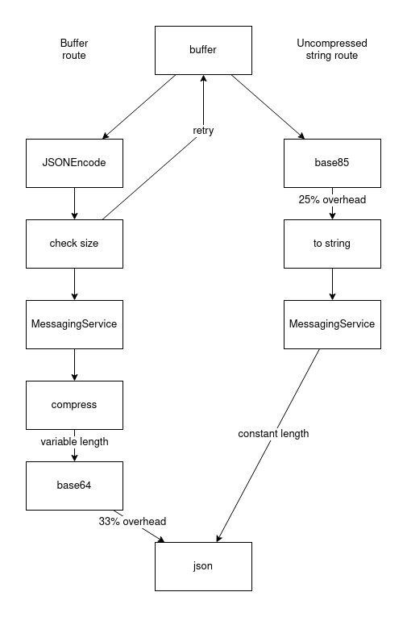

+++
title = "Buffer efficiency"
date = 2024-02-16 11:08:11
tags = ["roblox"]
+++

Is passing a buffer directly to MessagingService/DataStore actually better?
Mandatory compression means that a size check is required, which means double
encoding. Also does base64, which has worse size overhead than base85 via Luau.

For specialized data, the developer will be able achieve higher info density way
better than general compression ever could. I'd argue that the compression step
should be skipped entirely.
