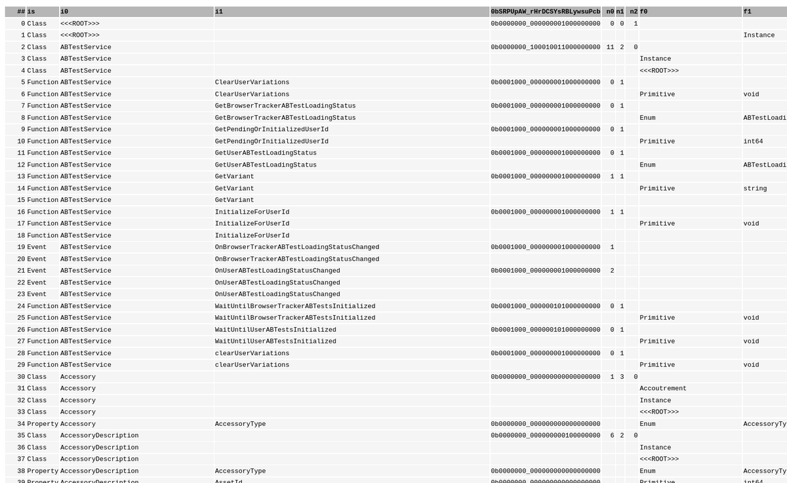

+++
title = "Static website database"
date = 2024-04-10 18:39:27
tags = ["rbxapiref"]
+++

Working out how to do searches on a static website. This hinges on the
assumption that testing 21k+ entries is surprisingly fast.

Fun fact: The size of this table is 3490.2x500505 pixels.
