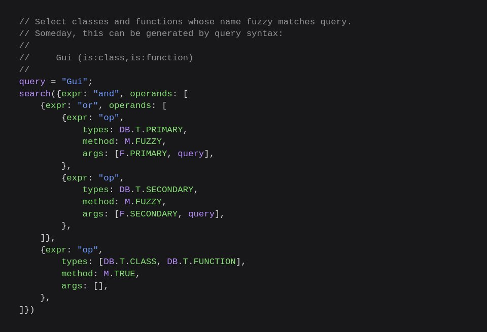
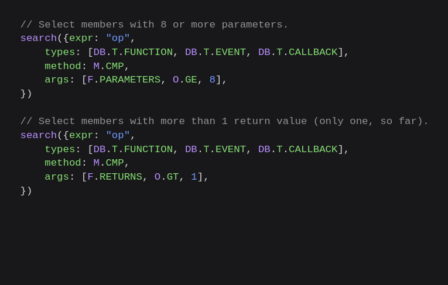
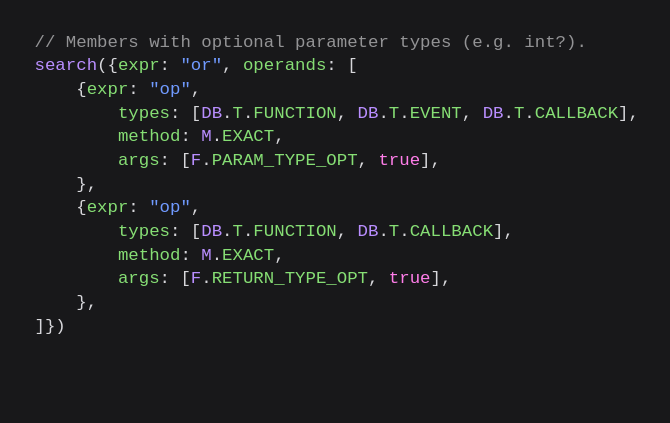

+++
title = "Query engine"
date = 2024-04-15 14:23:27
tags = ["rbxapiref", "codeimage"]
+++

Implemented a query engine that can search for API items through just about any
aspect. As expected, it's quite fast.

For now, the plan is to use only the fuzzy matcher. After I replace the old
website, I can work on writing a parser than can utilize the entire engine.







The query syntax is made up. Here's the current plan:

```
Expressions

	foo bar     : expressions foo and bar
	foo && bar  : foo and bar
	foo, bar    : foo or bar
	foo || bar  : foo or bar
	!foo        : negation of foo
	(foo)       : expression grouping

Simple

	foo      : fuzzy match name to foo
	"foo"    : name exactly equal to foo
	/foo/    : match name to regexp foo
	*        : always match

Compound

	foo.     : match primary name to foo (e.g. class name)
	.bar     : match secondary name to bar (e.g. property name)
	foo.bar  : match primary name to foo and secondary name to bar

Fields

	is:foo              : of type "foo" (class, function, etc)
	tag:foo             : has tag "foo"
	has:foo             : has field "foo"
	removed:yes         : is removed
	superclasses:N      : number of superclasses (class)
	subclasses:N        : number of subclasses (class)
	members:N           : number of members (class)
	superclass:foo      : superclass foo (class)
	subclass:foo        : superclass foo (class)
	memcat:foo          : MemoryCategory foo (class)
	threadsafety:foo    : ThreadSafety foo (member)
	security:foo        : Security foo (member)
	cansave:yes         : CanSave (property)
	canload:yes         : CanLoad (property)
	readsecurity:foo    : ReadSecurity foo (property)
	writesecurity:foo   : WriteSecurity foo (property)
	valuetypecat:foo    : ValueType.Category foo (property)
	valuetypename:foo   : ValueType.Name foo (property)
	category:foo        : Category foo (property)
	default:foo         : Default foo (property)
	returns:N           : number of returns (function)
	parameters:N        : number of parameters (function)
	returntypecat:foo   : return.Type.Category foo (function)
	returntypename:foo  : return.Type.Name foo (function)
	returntypeopt:yes   : return.Type.Optional (function)
	paramtypecat:foo    : parameter.Type.Category foo (function)
	paramtypename:foo   : parameter.Type.Name foo (function)
	paramtypeopt:yes    : parameter.Type.Optional (function)
	paramname:foo       : parameter.Name foo (function)
	paramdefault:foo    : parameter.Default foo (function)
	enumitems:N         : number of enum items (enum)
	itemvalue:foo       : enum item value foo (enumitem)
	legacynames:N       : number of legacy names (enumitem)
	legacyname:foo      : legacy name foo (enumitem)
	typecat:foo         : type category foo (type)

String

	security:foo    : fuzzy match
	security:"foo"  : exact match
	security:/foo/  : regex match
	security:*      : always match

Numeric

	members:N    : field equal to N
	!members:N   : field not equal to N
	members:<N   : field less than N
	members:<=N  : field less than or equal to N
	members:>N   : field greater than N
	members:>=N  : field greater than or equal to N

Boolean

	removed:no     : match false
	removed:n      : match false
	removed:0      : match false
	removed:false  : match false
	removed:f      : match false
	removed:yes    : match true
	removed:y      : match true
	removed:1      : match true
	removed:true   : match true
	removed:t      : match true

Meta

	$types           : list entity types
	$tags            : list entity tags
	$securities      : list security field values
	$threadsafeties  : list threadsafety field values
	$typecats        : list type categories

Results

	limit:50     : set result limit to 50 (default)
	limit:0      : set no result limit
	order:foo    : sort ascending by field foo
	order:<foo   : sort ascending
	order:>foo   : sort descending
	order:score  : sort descending by score (default)
	order:name   : sort ascending by name
	go:docs      : Redirect to CreatorHub page of 1st result
	go:git       : Redirect to creator-docs repo page of 1st result
```