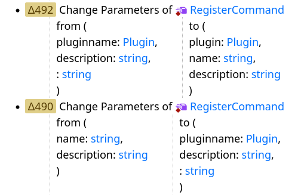

+++
title = "Missing separator"
date = 2024-04-27 23:09:10
tags = ["roblox"]
+++

The changes shown in this image hint at how parameters are named internally in
Roblox's engine. It's clear that someone missed a separator when adding the
"plugin" parameter.

