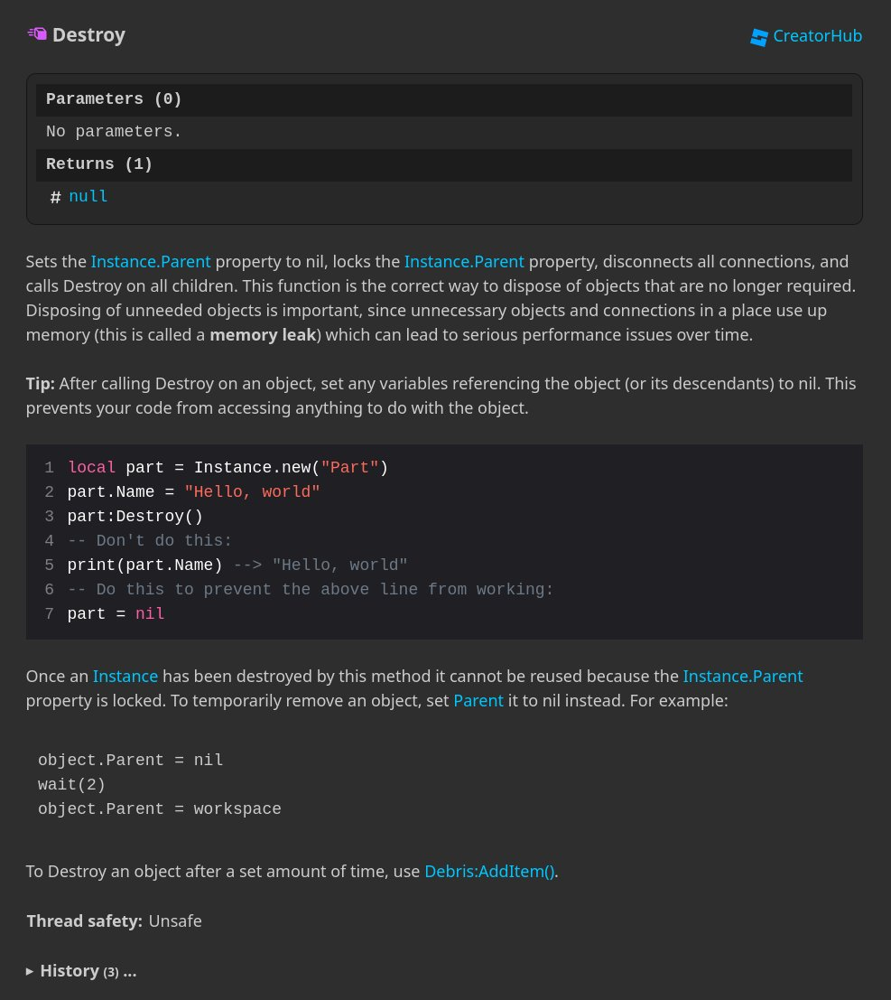

+++
title = "Engine documentation"
date = 2024-09-13 18:00:30
tags = ["rbxapiref"]
+++

Happy spooky friday! The API reference now has engine documentation included
directly for classes and enums.
https://robloxapi.github.io/ref/

