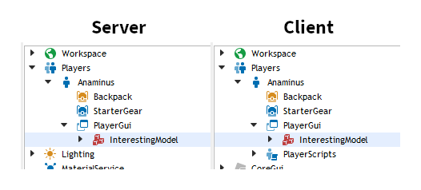
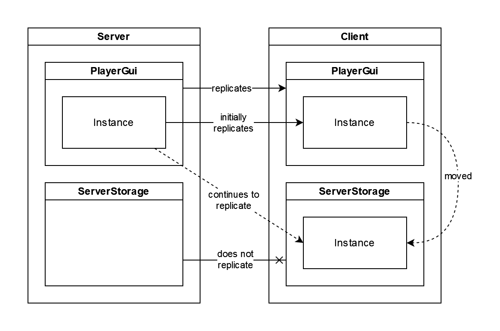
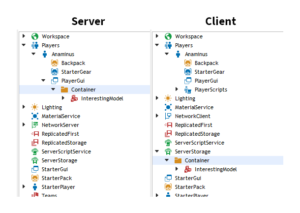
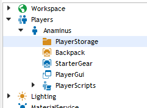

+++
title = "Exclusive replication"
date = 2022-11-20 12:00:00
+++

Instances in Roblox **replicate**. That is, a particular instance on the server
will have a copy of itself on each client, and all aspects of this instance are
kept synchronized, including what children it has. In almost all cases, this
replication occurs in one direction only, from server to client.

Say the server has a red brick in the Workspace. This brick will be replicated
to all clients. When the server changes the brick's color to blue, this change
will be replicated to each client, making their local copy of the brick also
blue. However, when a client tries to change the color of its brick to green,
this change is *not* replicated back to the server or any other client. The
change remains local to the client. Moreover, because only changes are
replicated, the server wont constantly be trying to update the brick's color
back to red, so it will remain green, at least until the server changes the
color again.

A problem with most instances is that they have only two replication behaviors:

- **All**: The instance is replicated to all clients.
- **None**: The instance is not replicated to any client.

This can be annoying if we have an instance that we want to show only to one
client. Or if we want to keep network usage down, we want to replicate only
relevant instances instead of absolutely everything.

Note that I said "most" instances. There is in fact exactly *one* instance that
has a different behavior. If you look at the [documentation page for
PlayerGui][PlayerGui], you will see that it has a curious tag called `Player
Replicated`. The tag's tooltip says the following:

> This object’s replication behavior is dependent on the player who owns it.

What this means is that the PlayerGui replicates only to one client.
Specifically, PlayerGui's parent Player instance.

It makes sense in context. GUIs are rendered locally on the client only for the
one player. It doesn't make sense to render everyone else's GUIs, so there's no
point in replicating them either.

We can use this as a solution to our problems. To replicate an instance
exclusively to one client, we can copy the instance to the client's PlayerGui.

<figure>

<figcaption>
You can put anything under the PlayerGui.
</figcaption>
</figure>

I use the term "exclusive" here rather than "selective", because this technique
doesn't actually let us select which clients a specific instance is replicated
to. Instead, we have to make a copy of the instance on the server for each
client we want to replicate to. It's possible to write a module that manages all
of this for us, at which point the module could be called selective. But the
underlying technique is exclusive.

Anyway, we can now choose which clients to replicate to, but there are some new
problems to take care of. Because we are using the PlayerGui, we have to
consider its other behaviors. Namely, that it renders ScreenGuis placed under
it. We want to be able to exclusively replicate a ScreenGui without
unintentionally rendering it. We could make an exception, such as forcing
`ScreenGui.Enabled` to false before replicating, but there's a more general
solution.

Remember how I said that changes on the client do not replicate back to the
server? This includes moving the instance around. An instance on the server is
matched to an instance on the client by the instance itself, rather than its
location. So, on the client, as long as the instance stays under the DataModel,
it will continue to receive changes from the server no matter where it is
located.

<figure>

</figure>

Instead of putting instances directly in the PlayerGui, let's put them in a
Folder that is located under the PlayerGui. On the server, the Folder must
always stay here. On the client however, it can be moved to anywhere we want. By
moving it outside of the PlayerGui, the replication behavior is retained, while
the GUI-rendering behavior is dropped.

<figure>

<figcaption>
Changes to the Container on the server are still replicated to the Container on
the client, no matter where it is located. ServerStorage is perfectly usable on
the client, and makes for a good location to store the Container.
</figcaption>
</figure>

There is only one more problem now: by default, all instances under the
PlayerGui will be removed before the player's character respawns. For
ScreenGuis, this can be prevented with the ResetOnSpawn property, but Folders do
not have this. Fortunately, there is the
[StarterGui.ResetPlayerGuiOnSpawn][ResetPlayerGuiOnSpawn] property. While this
is listed as deprecated, it can still be used just fine. However, it is also
hidden from the properties panel in Studio, so the command bar is needed in
order to change it:

```lua
game.StarterGui.ResetPlayerGuiOnSpawn = false
```

Setting this property to false will prevent any instance under the PlayerGui
from being removed when the character respawns. Note that this does change
StarterGui behavior, so we'll have to adjust accordingly.

Overall, this is a very hacky workaround. But hopefully it justifies the
addition of some kind of "PlayerStorage" container, whose only purposes is to
replicate its descendants to one player at a time. There are other more
complicated solutions to selective replication, but I feel like this would be a
good and very simple intermediate step.

<figure>

<figcaption>
Get an icon ready!
</figcaption>
</figure>

[PlayerGui]: https://create.roblox.com/docs/reference/engine/classes/PlayerGui
[ResetPlayerGuionSpawn]: https://create.roblox.com/docs/reference/engine/classes/StarterGui#ResetPlayerGuiOnSpawn
