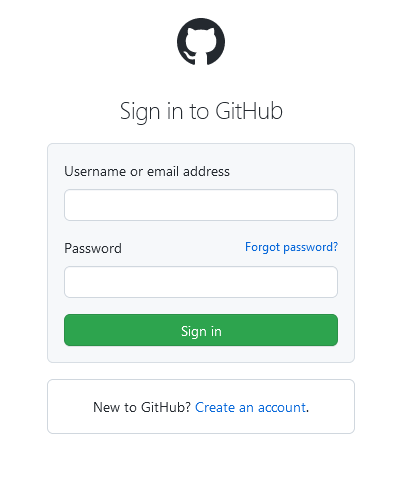
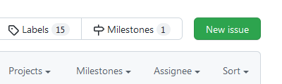

+++
title = "Stop linking to issues/new"
date = 2022-03-04
tags = ["github", "rant"]
+++

You have a neat software project. This project has a presence on GitHub. Maybe
you host the source code there, maybe you're just leveraging the issue tracker.

Your project also has a website. You know that your users will have problems
with your software, so you want to direct them from your website to your issue
tracker. You want them to have the most streamlined experience possible, so you
get the bright idea of linking to <a>issues/new</a>. How convenient! One click,
and they're able to start writing a report immediately! Except, that isn't what
happens.

<figure>

<figcaption>
What actually happens when users click on your link.
</figcaption>
</figure>

Ugh. Don't assume my intentions. All you had to do was link to the issue page.
It's not like opening a new issue from there is hard.

<figure>

<figcaption>
Can't miss it.
</figcaption>
</figure>

Other reasons why you may not want to do this:
- Non-GitHub users are stonewalled from even viewing your tracker without
  backtracking to find an alternate route.
- A user wants to check for an existing issue before submitting their own. Have
  you been noticing a lot of duplicates?

If you *are* going to pull this stunt, maybe you could at least link to the
issue tracker at the same time?

----

*Have a problem with this blog? <a
href="https://www.youtube.com/watch?v=Jne9t8sHpUc">Submit a new issue</a>, or <a
href="https://www.youtube.com/watch?v=dQw4w9WgXcQ">view all of them</a>. See?
That wasn't so hard.*
