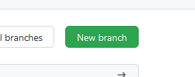
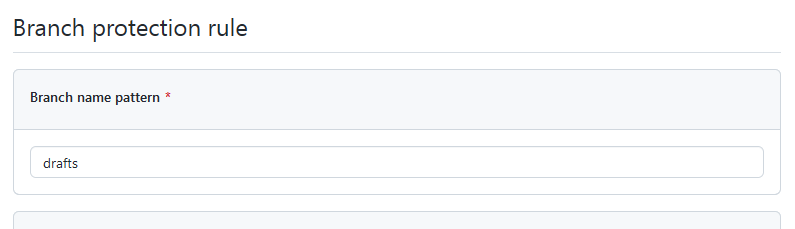
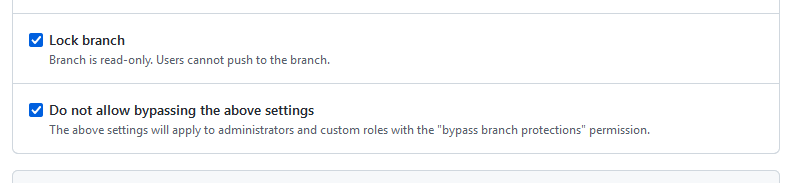
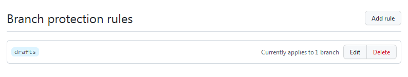
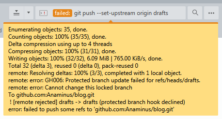

+++
title = "Securing secret branches"
date = 2022-11-06
+++

Most posts I write will never be published. But I still keep them around
locally, because they often contain useful bits that will likely find their way
into another post.

The blog is managed by git. When I want to publish a new post, I just commit and
push ("pushlish"?). I keep drafts on a separate branch that stays local.

But how do I make sure it stays local? I don't want to accidentally push super
secret drafts to GitHub! Fortunately, GitHub has what are called "Protection
rules".

To set it up, first the branch needs to be on GitHub. It's easy enough to create
a new branch on the website by going to the `/branches` page.

The branch has to be based off of another one. I used the same branch as what my
local `drafts` branch is based off of. This will make accidental pulls safe,
since git will just think the local branch is the latest.

Next, I went to Settings, then Branches, and added a new Branch protection rule,
where the pattern matched the name of the branch:

Then I included the Lock branch rule. This will prevent me from pushing to it. I
also included the "Do not allow bypassing above settings". Seems like a safe
thing to do.

Saved the rule, and that's it.

Now when I try to push to the branch, GitHub will reject the attempt.

Notably, git still tries to upload everything, and the rejection comes
afterwards. I could add a local pre-push hook to prevent the uploading, but I'm
not worried about it. The point is to prevent the drafts from becoming public,
which has already been accomplished.
