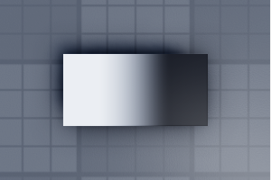
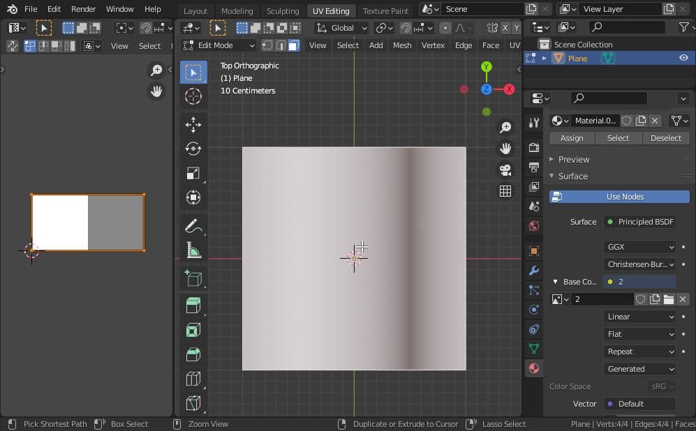
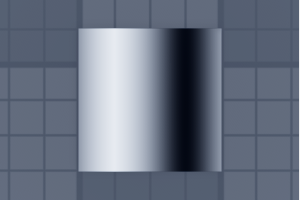
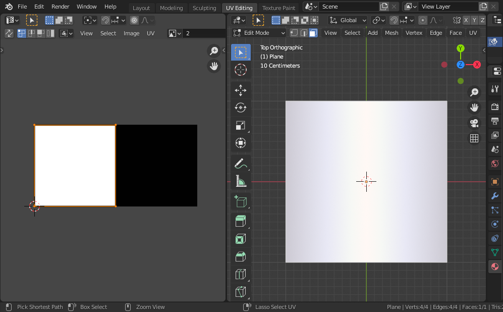
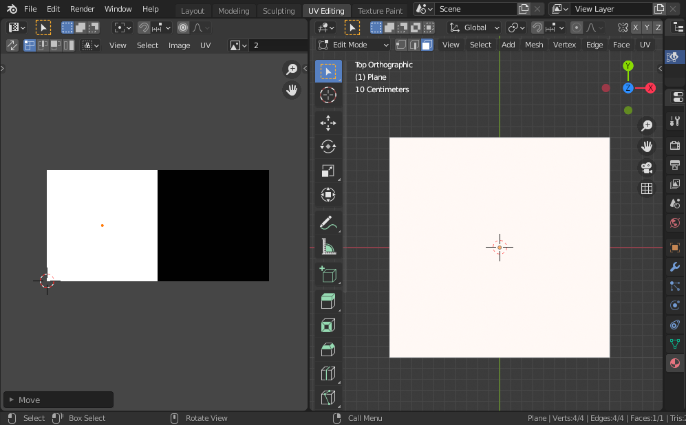
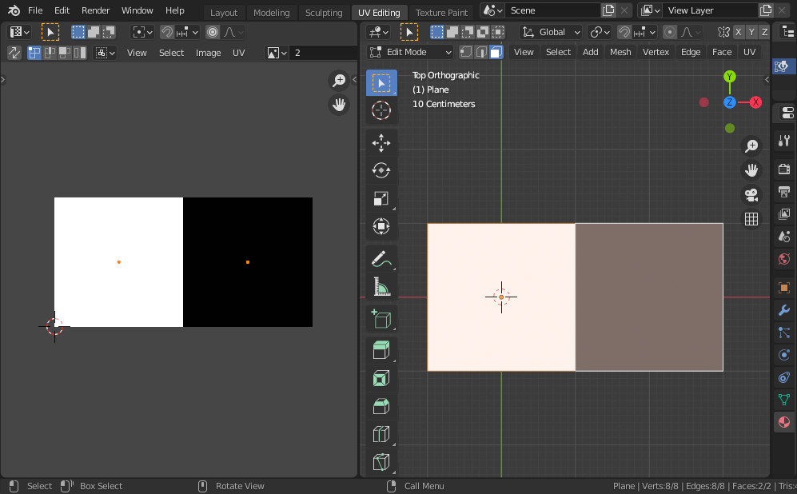
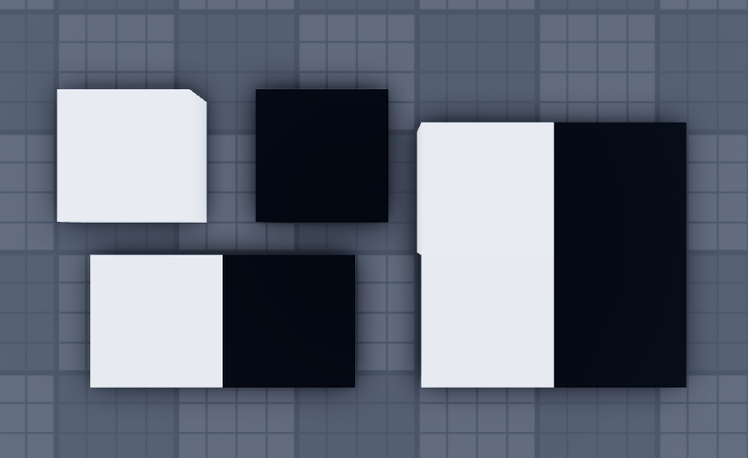
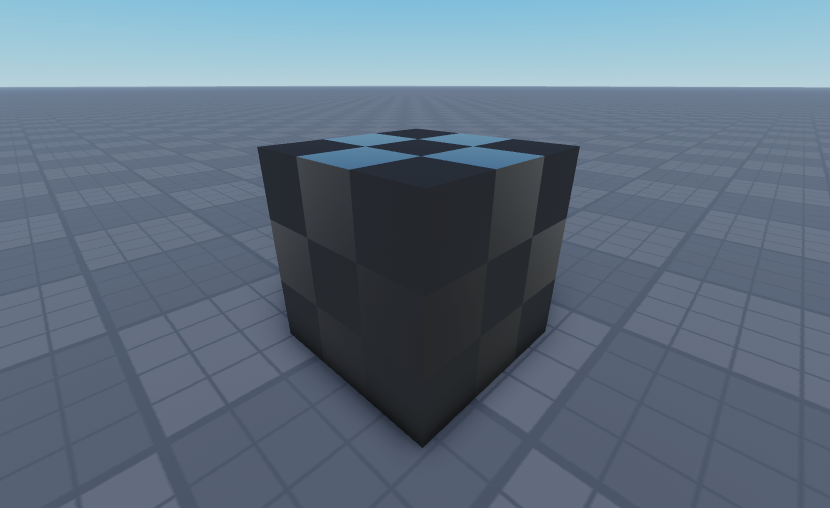

+++
title = "Tiny UVs"
description = "Making minimal and efficient UVs in Blender for Roblox."
date = 2022-09-24
tags = ["roblox", "blender", "gamedev"]
+++

You want to produce meshes with simple, solid color textures. Because the colors
are solid, you should be able to get away with using small textures. Tiny
textures. Single-digit resolution textures. Possible, right?

The problem: Roblox applies linear interpolation to its textures. Here is a
2-by-1 Decal, where the left pixel is white, and the right pixel is black:

Indeed, the left side is white, and the right side is black, but in between,
there is a smooth, linear interpolation from one pixel to the other.

When constructing UVs for a mesh, we'll have to find a way around this. Let's
head over to Blender, and work on a simple plane mesh:

The interpolation of the texture should be set to **Linear**, and the extension
should be set to **Repeat**. This will match how Roblox renders textures on
MeshParts. When we import it into Roblox, it looks mostly similar:

Notably, the left side begins to fade towards black, while the right side fades
towards white, which proves that the texture repeats. So we'll be able to use
Blender to get a rough idea of what Roblox will render.

So how do we produce solid colors? We can't just cover the whole pixel with a
face, because half of the pixel is always interpolating to its neighbor:

To get a solid color, the coordinates have to be in the exact center of the
pixel:

Two faces, each using one color:

But does it work in Roblox?

Indeed! To compare the colors, the top squares are regular Parts, while the
bottom squares are the mesh.

UV coordinates are reused for SurfaceAppearance textures, so this technique can
be used to set the roughness and metalness of surfaces as well:

**Tip:** To set the coordinates of many faces at once, select all the faces, use
the scale tool, and set the scale amounts to 0. This will move all vertices to a
single location, which you can then move to the center of the desired pixel.

Another interesting idea: Because colors are interpolated, we could set the
coordinates to somewhere besides a pixel center, in order to get more colors.
For example, the simple 2-by-1 white-to-black texture can also be used to get
any shade of gray.
