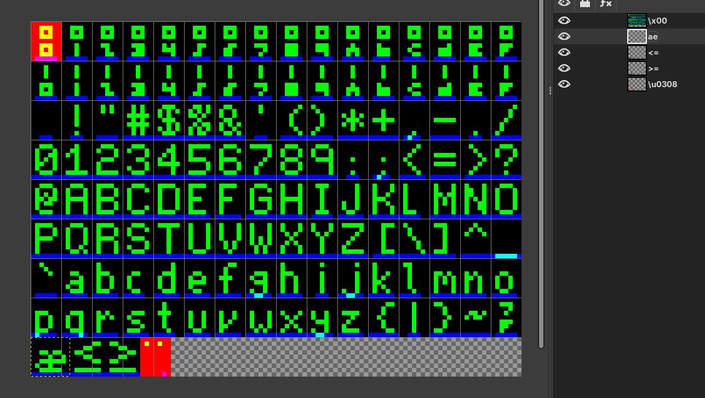
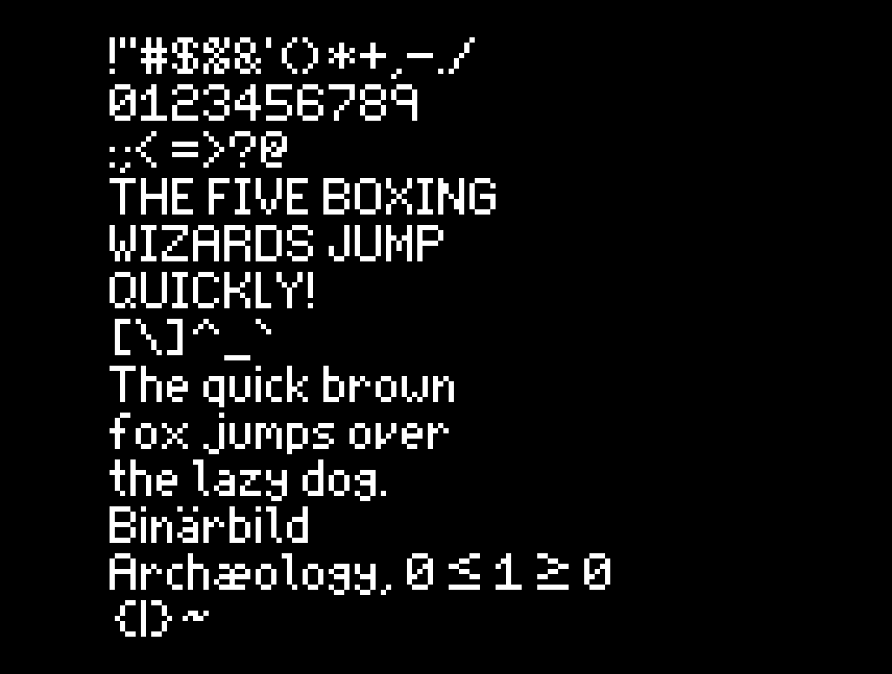

+++
title = "Proportional bitmap fonts"
date = 2025-08-12 15:22:00
tags = ["gamedev"]
+++

<section>

Here's a method for producing proportional bitmap fonts. The red component
defines the drawable area for each glyph. Green defines the actual appearance.
Blue defines the origin and spacing. Blank glyphs are skipped.

</section>

<section>

Layers are used to define groups of characters, allowing any part of the unicode
codespace to be specified. A layer name with a single code point defines a
sequential group. Ligatures are possible by defining a layer name with more than
one code point.

</section>

<section>

Text is rendered by placing the left-most blue pixel of a glyph over the
right-most blue pixel of the previous glyph. Using a baseline instead of
boundaries for glyph placement allows glyphs to be spaced arbitrarily, and even
drawn over each other.

</section>
